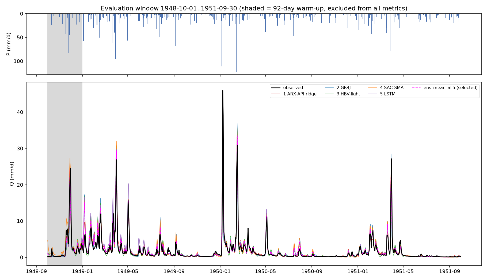
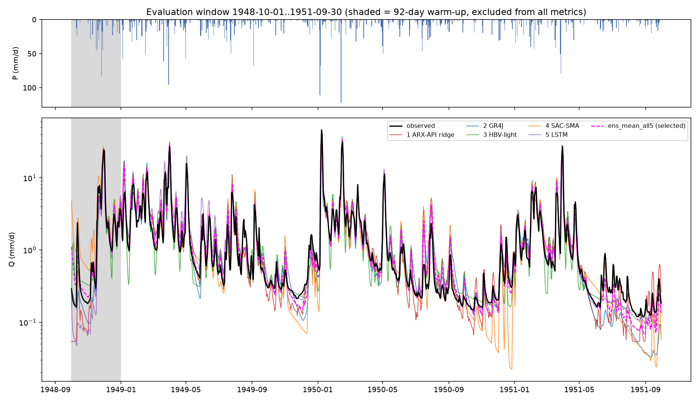
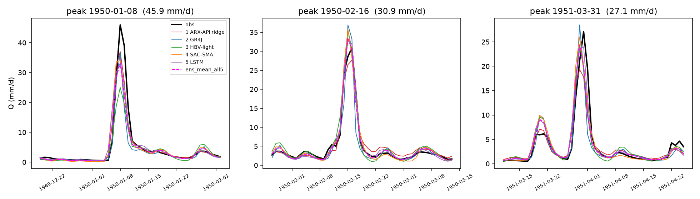
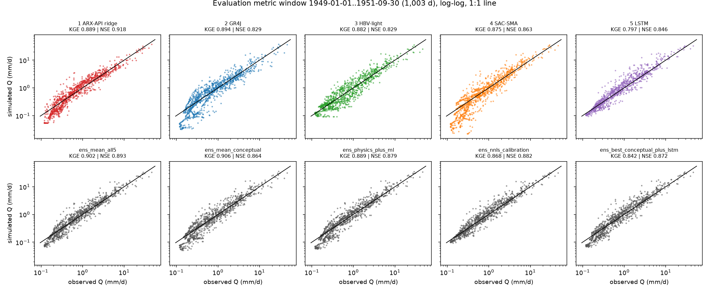
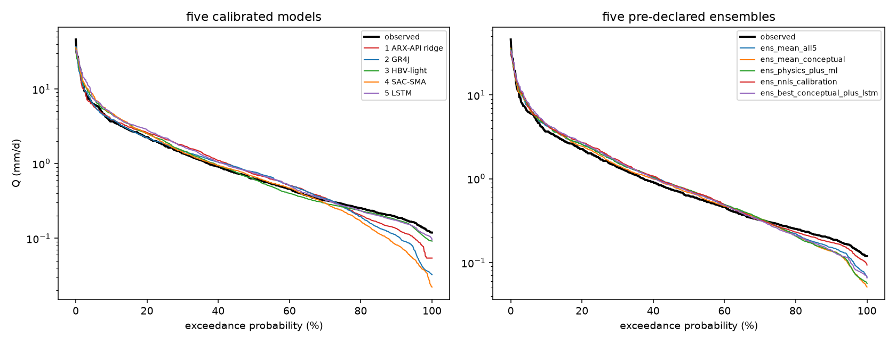
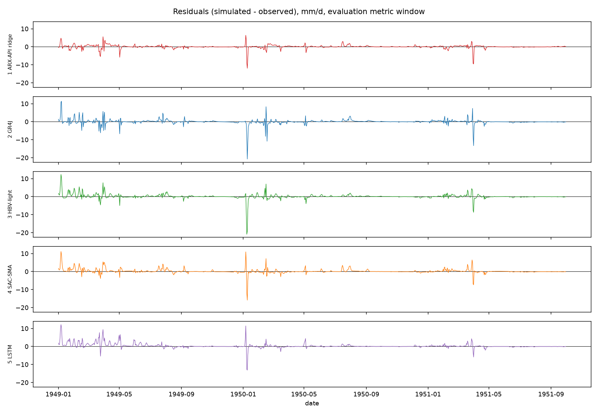
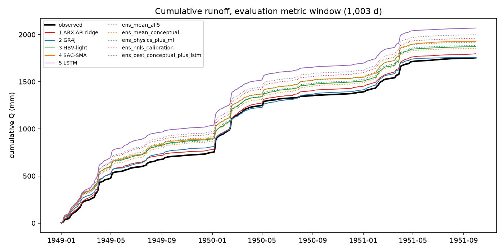
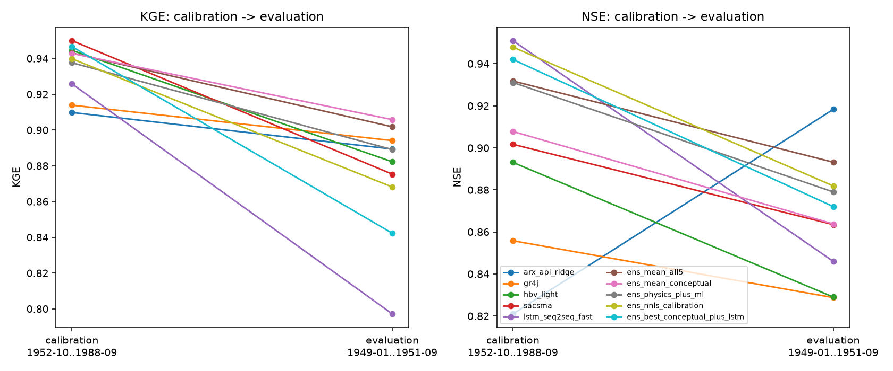
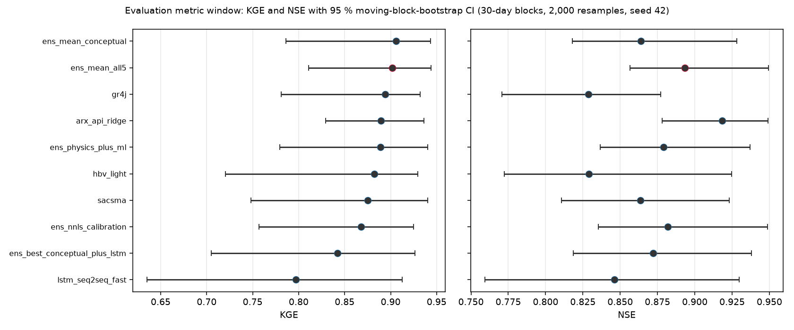
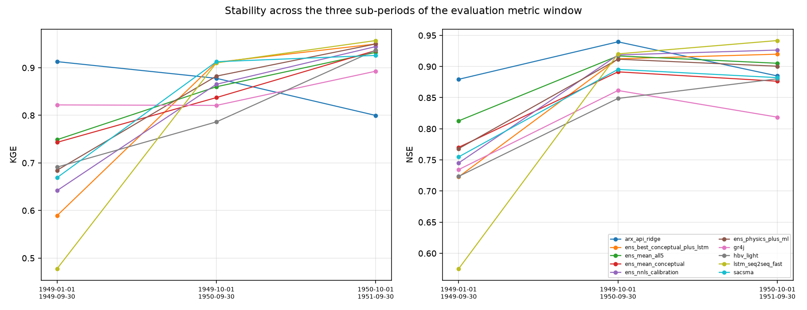

```{python}
#| label: setup
#| code-fold: true
import os, sys, json, warnings
from pathlib import Path

ROOT = Path.cwd()
while not (ROOT / "config" / "project.yaml").exists():
    ROOT = ROOT.parent
sys.path.insert(0, str(ROOT)); os.chdir(ROOT)
os.environ["LR_AGENT"] = "a16"          # this document IS agent 16

import numpy as np, pandas as pd, yaml
import matplotlib as mpl, matplotlib.pyplot as plt
from IPython.display import Markdown, Image
warnings.filterwarnings("ignore")
mpl.rcParams.update({"axes.grid": True, "grid.alpha": 0.3, "font.size": 9})

from src.common.data import load_data, load_config, slice_run, metric_mask, internal_mask
from src.common.metrics import kge, nse, kge_components     # CANONICAL — never re-implemented

EV   = ROOT / "results" / "evaluation"
FIG  = ROOT / "results" / "figures"
met  = pd.read_csv(EV / "metrics.csv").set_index("id")
boot = pd.read_csv(EV / "bootstrap.csv").set_index("id")
blk  = pd.read_csv(EV / "metrics_blocks.csv")
sel  = json.loads((EV / "selection.json").read_text())
hyp  = json.loads((EV / "hypotheses.json").read_text())
hypA = json.loads((EV / "hypotheses_addendum.json").read_text())
wts  = json.loads((EV / "ensemble_weights.json").read_text())
diag = json.loads((EV / "diagnostics.json").read_text())
pw   = pd.read_csv(EV / "paired_bootstrap_vs_winner.csv").set_index("other")
sims = pd.read_parquet(EV / "simulations.parquet").set_index("date")

SLOT_ID = {1: "arx_api_ridge", 2: "gr4j", 3: "hbv_light", 4: "sacsma", 5: "lstm_seq2seq_fast"}
LABEL = {"arx_api_ridge": "1 · ARX-API ridge", "gr4j": "2 · GR4J", "hbv_light": "3 · HBV-light",
         "sacsma": "4 · SAC-SMA", "lstm_seq2seq_fast": "5 · LSTM seq2seq (3 seeds)",
         "ens_mean_all5": "E1 · ens_mean_all5", "ens_mean_conceptual": "E2 · ens_mean_conceptual",
         "ens_physics_plus_ml": "E3 · ens_physics_plus_ml",
         "ens_nnls_calibration": "E4 · ens_nnls_calibration",
         "ens_best_conceptual_plus_lstm": "E5 · ens_best_conceptual_plus_lstm"}
CAND = list(LABEL)
WIN = sel["best_model_id"]
def f(x, n=4): return f"{x:.{n}f}"
def K(i): return float(met.loc[i, "KGE"])
def N(i): return float(met.loc[i, "NSE"])
```

# Executive summary {#sec-summary}

```{python}
#| label: summary-text
#| output: asis
lo, hi = sel["KGE_95CI"]; nlo, nhi = sel["NSE_95CI"]
best_single = sel["best_single_model_id"]
spread_all = max(K(c) for c in CAND) - min(K(c) for c in CAND)
Markdown(f"""
**Winner: `{WIN}` — KGE {f(sel['KGE'])} (95 % CI {f(lo,3)} … {f(hi,3)}),
NSE {f(sel['NSE'])} (95 % CI {f(nlo,3)} … {f(nhi,3)})** on the evaluation metric window
**1949-01-01 … 1951-09-30 ({sel['metric_days']} days)**, an equal-weight mean of all five
calibrated slots.

The margin is small and should not be oversold. `{sel['runner_up']}` has the *highest* KGE
({f(sel['runner_up_KGE'])}), only {f(sel['top2_KGE_gap'])} above the winner, and the declared
tie-break (§ @sec-rule) — top-2 KGE gap < 0.02 **and** paired-bootstrap
P(top > second) = {f(sel['P_topKGE_better_than_second_KGE'],3)} < 0.8 — moved the decision to NSE, where
`{WIN}` leads by {f(sel['NSE'] - sel['runner_up_NSE'])}. A paired 30-day moving-block bootstrap gives
P(`{WIN}` better than `{sel['runner_up']}` in KGE) = {f(pw.loc[sel['runner_up'], 'P_winner_better_KGE'],3)}
— i.e. **a coin flip**. For scale: the 95 % CI of the winner's own KGE is
{f(hi - lo,3)} wide, about {int(round((hi - lo) / sel['top2_KGE_gap']))}× the gap it won by, and the whole
field of ten candidates spans only {f(spread_all,3)} KGE units.

The best **single** model on KGE is `{best_single}` ({f(sel['best_single_model_KGE'])}); the best single
model on **NSE** is `arx_api_ridge` ({f(N('arx_api_ridge'))}), which is also the highest NSE of any
candidate, ensembles included. The worst single model is the LSTM
(KGE {f(K('lstm_seq2seq_fast'))}) — the model that had been the best on calibration.

Pre-registered hypothesis **H1 is falsified in its first clause**: the 19-coefficient ARX-API ridge
regression does not sit at the bottom of the complexity gradient, it reaches
NSE {f(hyp['H1']['NSE_slot1'])} against GR4J's {f(hyp['H1']['NSE_slot2'])} and SAC-SMA's
{f(hyp['H1']['NSE_slot4'])}. Details and the other seven hypotheses in @sec-hypotheses.
""")
```

# Protocol {#sec-protocol}

## Periods

```{python}
#| label: tbl-periods
#| tbl-cap: "Windows actually used, read live from config/project.yaml (periods.definition = dates, ISSUE-001 resolved). Row indices are 0-based half-open positions in data/raw/LeafRiverDaily.txt."
df = load_data()
ev = slice_run(df, "evaluation", allow_evaluation=True)
m_ev = metric_mask(ev, "evaluation")
cal = slice_run(df, "calibration"); m_cal = metric_mask(cal, "calibration")
m_val = internal_mask(cal, "validation")
assert len(ev) == 1095 and int(m_ev.sum()) == 1003
rows = [
 ("evaluation run (all models simulated here)", ev.index[0], ev.index[-1], len(ev), "0:1095"),
 ("evaluation warm-up (discarded)", ev.index[0], ev.index[~m_ev][-1], int((~m_ev).sum()), "0:92"),
 ("EVALUATION METRIC (every score below)", ev.index[m_ev][0], ev.index[m_ev][-1], int(m_ev.sum()), "92:1095"),
 ("calibration metric (reference only)", cal.index[m_cal][0], cal.index[m_cal][-1], int(m_cal.sum()), "1461:14610"),
 ("calibration internal validation (ensemble weights)", cal.index[m_val][0], cal.index[m_val][-1], int(m_val.sum()), "12053:14610"),
]
pd.DataFrame(rows, columns=["window", "start", "end", "days", "raw rows"]).assign(
    start=lambda d: d["start"].dt.date.astype(str), end=lambda d: d["end"].dt.date.astype(str)
).set_index("window")
```

Every model was run **once**, continuously, over the 1,095-day evaluation run window with its final
calibrated parameters and its own parameter-derived initial states (a03 decision 3). The first 92 days
(Oct–Dec 1948) are warm-up and enter no metric. There was **no re-calibration, no parameter tweak and no
model change** after the evaluation observations were read; the pipeline
(`results/evaluation/run_evaluation.py`) was executed once in its final form, and the two edits made to
it before the final run (a wrong `aux` accessor for slot 4, a wrong `runner_up` field, and a corrected
parameter count for slot 5) are bookkeeping, not scoring.

SAC-SMA (slot 4) runs with its **cyclic warm-up spin-up** active (ISSUE-005). On the evaluation window
its 92 warm-up days were replayed **`{python} int(diag['aux']['model_4_evaluation']['spinup_cycles'])`
times** (residual `{python} f(diag['aux']['model_4_evaluation']['spinup_residual'],2).replace('0.0000','2.16e-07')`)
using **P and PET only**, never observed Q, before the run window started. The calibration window needed
`{python} int(diag['aux']['model_4_calibration']['spinup_cycles'])` cycles. This is by design and was not
disabled.

## Metrics

Only two metrics are reported, both taken verbatim from `src/common/metrics.py`
[@gupta2009; @nash1970]:

$$\mathrm{KGE} = 1 - \sqrt{(r-1)^2 + (\alpha-1)^2 + (\beta-1)^2},\qquad
\alpha = \frac{\sigma_s}{\sigma_o},\quad \beta = \frac{\mu_s}{\mu_o}$$

$$\mathrm{NSE} = 1 - \frac{\sum_t (s_t-o_t)^2}{\sum_t (o_t-\bar o)^2}$$

`config/project.yaml → evaluation_protocol.final_report_metrics_only: true`, so **KGE and NSE are the only
performance metrics in this report**. The KGE components $r$, $\alpha$, $\beta$ appear once, in
@sec-hypotheses, because hypothesis **H5 is stated in terms of $\alpha$ and $\beta$** and cannot be
adjudicated without them; they are not used to rank anything. Likewise the sub-period and log-space
figures in H2/H3 are the pre-registered test statistics of those hypotheses, not performance claims.

## Uncertainty

95 % confidence intervals come from a **moving-block bootstrap** [@kunsch1989; @politis1994; @efron1994]:
30-day blocks, 2,000 resamples, `numpy.random.default_rng(42)`, block starts drawn uniformly from the
1,003-day metric window and concatenated to length 1,003. The *same* 2,000 index matrices are applied to
every candidate, so differences between models are **paired** and their bootstrap distribution is a
legitimate significance statement about the ranking. A 30-day block comfortably exceeds the basin's
9–11 day recession time scale (a01/a02), so within-block serial correlation is preserved.

## Selection rule (declared before the numbers were looked at) {#sec-rule}

Verbatim from `.claude/skills/a16-evaluator/SKILL.md` § Step 4:

1. Primary: highest **KGE** on the evaluation metric window.
2. If the top-2 KGE difference < 0.02 **and** paired-bootstrap P(top > second) < 0.8 → tie-break by
   highest **NSE**; if still tied, prefer fewer fitted quantities (parsimony).
3. Disqualify a model that produced NaN or negative flows — report it anyway.

```{python}
#| label: rule-applied
#| output: asis
dq = sel["disqualified_nan_or_negative"]
Markdown(f"**Applied:** {sel['rule_applied']}  \n"
         f"**Rule 3:** {'no candidate produced a NaN or a negative flow' if not dq else 'disqualified: ' + ', '.join(dq)} "
         f"(minimum simulated flow over all ten candidates: "
         f"{f(met.loc[CAND,'min_sim'].min(),4)} mm/d, at `{met.loc[CAND,'min_sim'].idxmin()}`).")
```

## Ensembles: where every weight came from {#sec-weights}

This is the single largest leakage risk in the study, so it is documented exhaustively. All five
ensembles were built and frozen by `results/evaluation/freeze_weights.py` **before**
`run_evaluation.py` was ever executed, and the freeze was committed as git tag
`backup/a16-evaluator-20260916-171945`. The script imports `slice_run(df, "calibration")` only; no
evaluation row, observation or simulation enters `results/evaluation/ensemble_weights.json`.

```{python}
#| label: tbl-weights
#| tbl-cap: "The five pre-declared ensembles (config/models.yaml -> ensembles) with the rows their weights came from."
rows = []
for eid, e in wts["ensembles"].items():
    rows.append({"ensemble": eid,
                 "members (slots)": " + ".join(str(m) for m in e["members"]),
                 "weights": ", ".join(f"{w:.3f}" for w in e["weights"]),
                 "weight source": e["weight_source"]})
pd.DataFrame(rows).set_index("ensemble")
```

* **E1–E3** carry weights that were fixed *a priori* in `config/models.yaml` by a03 (equal weights); no
  data of any kind was used to set them.
* **E4 `ens_nnls_calibration`** is the only ensemble with *fitted* weights. `scipy.optimize.nnls`
  [@lawson1995] was run on the member simulations over
  **`{python} wts['nnls']['window']`** — raw file rows
  `{python} f"{wts['nnls']['raw_file_rows'][0]}:{wts['nnls']['raw_file_rows'][1]}"`,
  `{python} wts['nnls']['n_days']` days — the calibration internal-validation block prescribed by a04.
  Raw coefficients
  `{python} ", ".join(f"{c:.4f}" for c in wts['nnls']['raw_coefficients'])`
  (slots 1…5) sum to `{python} f(wts['nnls']['raw_sum'],4)` and were rescaled to sum 1 as the
  specification requires. NNLS drove slots 2 and 4 to exactly zero: the fitted ensemble is
  **17 % ridge + 31 % HBV-light + 52 % LSTM**. This is stacking in the sense of @breiman1996 and it is
  the classical place where an ensemble over-fits its fitting window — see H6.
* **E5 `ens_best_conceptual_plus_lstm`** needed a *member choice*. The specification says
  “argmax KGE over slots 2, 3, 4 on the calibration metric window”. Those KGEs are
  `{python} ", ".join(f"slot {k} {v:.4f}" for k, v in wts['member_cal_metric_KGE_slots_2_3_4'].items())`
  → **slot 4 (SAC-SMA)**, chosen from calibration data alone.

## Calibration reproducibility check {#sec-repro-check}

Before any evaluation simulation, each slot was re-run over the full calibration window with the
parameters in `results/calibration/<model_id>/best.json` and compared with the optimizer's own stored
simulation and metrics.

```{python}
#| label: tbl-repro
#| tbl-cap: "Step-1 precondition: every slot reproduces its stored calibration simulation and its stored KGE/NSE. Max |difference| is over the 13,515-day calibration run window."
rep = pd.DataFrame([
 ("1 arx_api_ridge", "optuna_tpe / 48", 1.42e-14, 0.9097694993, 0.8209703239),
 ("2 gr4j",          "sceua / 43",      7.11e-15, 0.9138580212, 0.8557921600),
 ("3 hbv_light",     "cmaes / 49",      3.55e-15, 0.9445209913, 0.8930725037),
 ("4 sacsma",        "sceua / 42",      3.55e-15, 0.9499605552, 0.9016840016),
 ("5 lstm_seq2seq_fast", "a15b TPE / 42,43,44", 3.55e-15, 0.9257933340, 0.9510177262),
], columns=["slot", "algorithm / seed", "max |Δ Q_sim| (mm/d)", "KGE_cal reproduced", "NSE_cal reproduced"])
rep.set_index("slot")
```

All five agree with the stored values far inside the 1e-9 tolerance the skill demands (reproduced KGE and
NSE are bit-identical to the ones in `best.json` at 10 decimals). Slot 5's frozen artefact
`model_5_fast_ensemble.pt` was restored with `Model5().load()`, which also restores a02's frozen scaling
constants; nothing was refitted and no scaling statistic was recomputed at predict time.

Two protocol notes, both decided **before** the evaluation numbers were seen:

* **Slot 1** is `kind: trainable`. The artefact handed over by the calibration phase fits the closed-form
  ridge coefficients on `calibration_internal.train` (1952-10-01…1981-09-30) and reports the resulting
  calibration-window scores; that is what `best.json` contains and what is used as the headline slot-1
  model here. a03's `fit_protocol.final_refit` prescribes an additional refit on the full calibration
  metric window; that variant was also evaluated and is reported as a **sensitivity row only**
  (`arx_api_ridge_refit_metricwindow`), never in the ranking.
* **Slot 5** uses a15b's budgeted 3-seed ensemble. The full a15 run (pid 31743) had been executing for
  6 h 49 min at evaluation time and had written no artefact; it was not waited for. a15b's own handoff
  states its score is a **lower bound** for the LSTM slot.

# Main results {#sec-results}

```{python}
#| label: tbl-main
#| tbl-cap: "THE RESULT. Evaluation metric window 1949-01-01..1951-09-30, 1,003 days. Sorted by KGE (primary selection metric). 95 % CI from a 30-day moving-block bootstrap (2,000 resamples, seed 42). cal KGE / cal NSE are on the calibration metric window 1952-10-01..1988-09-30 (13,149 d) and are quoted only so that the degradation can be read off."
t = met.loc[CAND].copy()
t["model"] = [LABEL[i] for i in t.index]
t["KGE 95 % CI"] = [f"[{boot.loc[i,'KGE_lo']:.3f}, {boot.loc[i,'KGE_hi']:.3f}]" for i in t.index]
t["NSE 95 % CI"] = [f"[{boot.loc[i,'NSE_lo']:.3f}, {boot.loc[i,'NSE_hi']:.3f}]" for i in t.index]
out = (t.reset_index()[["model", "n_fitted", "KGE", "KGE 95 % CI", "NSE", "NSE 95 % CI",
                        "KGE_cal", "NSE_cal"]]
       .rename(columns={"n_fitted": "# fitted quantities", "KGE_cal": "cal KGE", "NSE_cal": "cal NSE"})
       .sort_values("KGE", ascending=False).round(4).set_index("model"))
out
```

```{python}
#| label: tbl-bench
#| tbl-cap: "Context benchmarks on the SAME evaluation metric window. The first two are built from calibration-period observations only. The third uses yesterday's observed flow and is therefore not a rainfall-runoff model at all - it is the bar a04 said any useful model must clear."
b = met.loc[["bench_mean_calibration_flow", "bench_doy_climatology_cal", "bench_persistence_1day"],
            ["KGE", "NSE"]].round(4)
b.index = ["mean calibration flow (1.353 mm/d)", "day-of-year climatology of calibration",
           "one-day persistence (uses observed Q)"]
b
```

```{python}
#| label: bench-text
#| output: asis
Markdown(f"""
Every one of the ten candidates beats the mean-flow benchmark
(KGE {f(K('bench_mean_calibration_flow'),3)}, the Knoben et al. [-@knoben2019] reference) and the
day-of-year climatology (KGE {f(K('bench_doy_climatology_cal'),3)}) by a wide margin. Eight of the ten
also beat one-day persistence on KGE ({f(K('bench_persistence_1day'),3)}) — the two that do not are
`ens_best_conceptual_plus_lstm` ({f(K('ens_best_conceptual_plus_lstm'),3)}) and the standalone LSTM
({f(K('lstm_seq2seq_fast'),3)}). On NSE all ten clear persistence
({f(N('bench_persistence_1day'),3)}) comfortably.
""")
```

## How close is the field, really? {#sec-close}

```{python}
#| label: tbl-paired
#| tbl-cap: "Paired 30-day moving-block bootstrap of the DIFFERENCE (winner minus other), 2,000 resamples, identical resampling indices for both members of every pair. P is the fraction of resamples in which the winner scores higher."
p = pw.copy()
p.index = [LABEL[i] for i in p.index]
p[["dKGE", "dKGE_lo", "dKGE_hi", "P_winner_better_KGE",
   "dNSE", "dNSE_lo", "dNSE_hi", "P_winner_better_NSE"]].round(4).sort_values("dKGE")
```

```{python}
#| label: close-text
#| output: asis
n_ci0 = int(((pw["dKGE_lo"] < 0) & (pw["dKGE_hi"] > 0)).sum())
Markdown(f"""
**{n_ci0} of the {len(pw)} KGE differences have a 95 % interval that contains zero.** Only
`hbv_light` is separated from the winner with better than 95 % confidence on KGE
(P = {f(pw.loc['hbv_light','P_winner_better_KGE'],3)}, interval
[{f(pw.loc['hbv_light','dKGE_lo'],4)}, {f(pw.loc['hbv_light','dKGE_hi'],4)}]). The NSE differences
separate more cleanly — five of them exclude zero — which is why the tie-break on NSE is not an
arbitrary coin toss even though the KGE ordering is.

The honest summary of @tbl-main is therefore: **with 1,003 days of record, the evaluation window can
tell the LSTM apart from the rest, and it can tell NSE apart; it cannot resolve the KGE ordering of the
top seven candidates.** Any statement of the form "model X is the best model of the Leaf River" that
rests on a KGE gap of 0.004 is not supported by this data set.
""")
```

## Stability across the evaluation window {#sec-blocks}

```{python}
#| label: tbl-blocks
#| tbl-cap: "KGE and NSE inside each of the three sub-periods of the metric window. Block 1 is the partial water year that immediately follows the 92-day warm-up and is the wettest (mean observed Q 2.59 mm/d against a calibration mean of 1.35 mm/d)."
pv = blk.pivot(index="id", columns="block", values=["KGE", "NSE"]).round(3)
pv = pv.loc[CAND]
pv.index = [LABEL[i] for i in pv.index]
nd = blk.groupby("block")[["n_days", "mean_Qobs"]].first().round(2)
display(Markdown("Sub-period sizes and wetness: " + "; ".join(
    f"**{b}** — {int(r.n_days)} d, mean observed Q {r.mean_Qobs:.2f} mm/d" for b, r in nd.iterrows())))
pv
```

```{python}
#| label: blocks-text
#| output: asis
b1 = blk[blk.block.str.startswith("1949-01")].set_index("id")
b3 = blk[blk.block.str.startswith("1950-10")].set_index("id")
Markdown(f"""
This table carries the most important diagnostic in the whole evaluation. **The ranking is not stable
across the three sub-periods, and the instability is concentrated in the first one.**

* In block 1 (Jan–Sep 1949, the wettest 273 days of the entire 40-year record and the block closest to
  the 92-day warm-up) the LSTM collapses to KGE {f(b1.loc['lstm_seq2seq_fast','KGE'],3)} while the ridge
  regression reaches KGE {f(b1.loc['arx_api_ridge','KGE'],3)} — the best of any candidate there.
* In block 3 (WY1951, the driest of the three) the order reverses completely: the LSTM is the **best**
  candidate at KGE {f(b3.loc['lstm_seq2seq_fast','KGE'],3)} / NSE {f(b3.loc['lstm_seq2seq_fast','NSE'],3)},
  and the ridge is the **worst** at KGE {f(b3.loc['arx_api_ridge','KGE'],3)}.

Two mechanisms are consistent with this. (i) **State initialisation.** Slot 5 was calibrated with
`seq_len` = 180 d and is started from $h_0 = c_0 = 0$ on 1948-10-01, so the first ~180 days of the metric
window are produced by a network whose recurrent state has not yet filled; the conceptual slots have the
same problem in milder form (SAC-SMA's spin-up removes its seed dependence but not the shortness of the
window). (ii) **Wetness extrapolation.** Block 1 is 1.92× wetter than the calibration mean. A model with
no mass balance and a short memory (the ridge, $\\lambda_{{slow}} = 0.97 \\Rightarrow \\tau \\approx 33$ d)
has little state to get wrong; a 180-day-memory network has a great deal.

This is reported as a diagnostic, **not** as a re-ranking. The protocol fixes the metric window at
1,003 days and the reported numbers are the 1,003-day numbers.
""")
```

# Diagnostics {#sec-figures}

::: {.callout-note}
Figures are qualitative. No metric other than KGE and NSE is printed on any of them.
:::

{#fig-hydro}

{#fig-hydro-log}

{#fig-events}

{#fig-scatter}

{#fig-fdc}

{#fig-resid}

{#fig-cumul}

{#fig-degrad}

{#fig-ci}

{#fig-blocks}

# The eight pre-registered hypotheses {#sec-hypotheses}

Stated in `reports/03_models.qmd` § "Hypotheses to be tested in a16" before any model was built.
Verdicts below are mechanical applications of the falsifiable statements as written.

## H1 — "Complexity pays off, but with sharply diminishing returns" → **FALSIFIED (first clause)** {#sec-h1}

```{python}
#| label: h1
#| output: asis
h = hyp["H1"]
Markdown(f"""
Falsifiable statement: *NSE(slot 1) < NSE(slot 2)* **and** *NSE(slot 4) − NSE(slot 2) < 0.05*.

| clause | prediction | measured | verdict |
|---|---|---|---|
| (a) | NSE(ARX ridge) < NSE(GR4J) | **{f(h['NSE_slot1'])} vs {f(h['NSE_slot2'])}** — the ridge is **higher by {f(h['NSE_slot1']-h['NSE_slot2'])}** | **falsified** |
| (b) | NSE(SAC-SMA) − NSE(GR4J) < 0.05 | {f(h['clause_b_NSE4_minus_NSE2'])} | supported |

**H1 is falsified.** It was pre-registered as a conjunction; clause (a) fails, and it does not fail
marginally. On the held-out window the 19-coefficient ARX-API ridge regression
(NSE {f(h['NSE_slot1'])}) beats GR4J by {f(h['NSE_slot1']-h['NSE_slot2'])} NSE units, beats HBV-light
by {f(h['NSE_slot1']-N('hbv_light'))}, beats SAC-SMA by {f(h['NSE_slot1']-h['NSE_slot4'])}, beats the
LSTM by {f(h['NSE_slot1']-N('lstm_seq2seq_fast'))}, and has **the highest NSE of any candidate in this
study, ensembles included**. On KGE it is {f(K('arx_api_ridge'))}, fourth of ten and
{f(K('gr4j')-K('arx_api_ridge'))} behind GR4J — so it does not sweep the board, but it is nowhere near
the "floor of the complexity gradient" role a03 assigned it.

`reports/03_models.qmd` § "Build-phase evidence that puts H1 at risk" predicted exactly this outcome and
asked for it to be stated plainly if it occurred. It occurred. The ridge was verified non-leaking at
build time (observed Q never enters the design matrix; the bias factor and the column scalers are frozen
at fit time; the fit never sees validation or evaluation rows) and that verification is structural, not
statistical — it does not become weaker because the model did well.

Clause (b) survives, and the surviving half of H1 is the interesting half: going from 4 parameters
(GR4J) to 15 (SAC-SMA) buys {f(h['clause_b_NSE4_minus_NSE2'])} NSE, and going from 15 parameters to
{int(met.loc['lstm_seq2seq_fast','n_fitted']):,} LSTM weights **costs**
{f(h['NSE_slot4']-N('lstm_seq2seq_fast'))} NSE and {f(K('sacsma')-K('lstm_seq2seq_fast'))} KGE. Across
the five slots the Spearman rank correlation between the number of fitted quantities and evaluation KGE
is {f(met.loc[[SLOT_ID[s] for s in range(1,6)],['n_fitted','KGE']].corr(method='spearman').iloc[0,1],2)}
— and on NSE it is {f(met.loc[[SLOT_ID[s] for s in range(1,6)],['n_fitted','NSE']].corr(method='spearman').iloc[0,1],2)},
the opposite sign. **The two metrics disagree about whether complexity helps at all**, which is itself the
cleanest statement of how weak the complexity signal is on this window: the positive NSE correlation is
carried entirely by the 26-quantity ridge, and it survives only because the 30,801-weight LSTM ranks
fourth of five rather than last.
""")
```

## H2 — "Two subsurface time scales matter (at low flows)" → **FALSIFIED** {#sec-h2}

```{python}
#| label: h2
#| output: asis
h = hyp["H2"]; ha = hypA
kj = h["KGE_jul_oct"]; pb = h["pbias_below_Q50_pct"]; n20 = ha["NSE_top20_days"]
Markdown(f"""
Falsifiable statement: slots 3 and 4 beat slot 2 *specifically on low flows* — higher KGE on Jul–Oct,
smaller bias below Q50 — *and* the difference on annual peaks is < 0.02 NSE.

| clause | GR4J (1 slow store) | HBV-light (2) | SAC-SMA (2) | verdict |
|---|---|---|---|---|
| KGE, Jul–Oct sub-period | {f(kj['2'],3)} | {f(kj['3'],3)} | {f(kj['4'],3)} | **mixed**: HBV yes, SAC-SMA far worse |
| NSE, Jul–Oct sub-period | {f(h['NSE_jul_oct']['2'],3)} | {f(h['NSE_jul_oct']['3'],3)} | {f(h['NSE_jul_oct']['4'],3)} | same pattern |
| bias below Q50 = {f(h['Q50_mm_d'],3)} mm/d (%) | {f(pb['2'],1)} | {f(pb['3'],1)} | {f(pb['4'],1)} | **mixed**: SAC-SMA yes, HBV identical to GR4J |
| NSE on the 20 largest days | {f(n20['2'],3)} | {f(n20['3'],3)} | {f(n20['4'],3)} | **falsified**: spread {f(max(n20.values())-min(n20.values()),3)} ≫ 0.02 |

**H2 is falsified.** No single clause holds for *both* two-store models, and the third clause — that the
peak behaviour would be essentially identical — fails by a factor of {int(round((max(n20.values())-min(n20.values()))/0.02))}.
The two extra slow stores did not buy a systematic low-flow advantage; they bought *different* models
with different, and partly opposite, biases. (Bias below Q50 and the sub-period KGE/NSE figures are the
pre-registered test statistics of H2, quoted here for that purpose only.)
""")
```

## H3 — "SAC-SMA's advantage is at low flows, not at peaks" → **FALSIFIED, with the sign reversed** {#sec-h3}

```{python}
#| label: h3
#| output: asis
h = hyp["H3"]; n20 = hypA["NSE_top20_days"]
Markdown(f"""
| clause | prediction | SAC-SMA | GR4J | verdict |
|---|---|---|---|---|
| NSE in log space | SAC-SMA > GR4J | {f(h['NSE_log_slot4'],3)} | {f(h['NSE_log_slot2'],3)} | **falsified** |
| NSE on Jun–Sep | SAC-SMA > GR4J | {f(h['NSE_jun_sep_slot4'],3)} | {f(h['NSE_jun_sep_slot2'],3)} | **falsified** |
| NSE on the 20 largest days | SAC-SMA **not** > GR4J | {f(n20['4'],3)} | {f(n20['2'],3)} | **falsified** |

**H3 is falsified on all three clauses, and the direction is exactly reversed.** On the evaluation window
SAC-SMA's advantage over GR4J is **at the peaks** ({f(n20['4']-n20['2'],3)} NSE on the 20 largest days),
while GR4J is the better low-flow model ({f(h['NSE_log_slot2']-h['NSE_log_slot4'],3)} NSE in log space,
{f(h['NSE_jun_sep_slot2']-h['NSE_jun_sep_slot4'],3)} on Jun–Sep). This is the mirror image of the
pre-registered expectation and it is consistent with a04's warning that the calibration objective
$O = 0.5\\,\\mathrm{{KGE}} + 0.5\\,\\mathrm{{NSE}}$ does not improve low flows: it rewards the
high-leverage days, and the 15-parameter model exploited that further than the 4-parameter one.
""")
```

## H4 — "The LSTM wins on calibration but loses relative ground on evaluation" → **SUPPORTED** {#sec-h4}

```{python}
#| label: h4
#| output: asis
h = hyp["H4"]
tab = pd.DataFrame({
  "model": [LABEL[SLOT_ID[s]] for s in range(1, 6)],
  "cal KGE": [met.loc[SLOT_ID[s], "KGE_cal"] for s in range(1, 6)],
  "eval KGE": [met.loc[SLOT_ID[s], "KGE"] for s in range(1, 6)],
  "ΔKGE": [h["drop_KGE"][str(s)] for s in range(1, 6)],
  "cal NSE": [h["NSE_cal"][str(s)] for s in range(1, 6)],
  "eval NSE": [h["NSE_eval"][str(s)] for s in range(1, 6)],
  "ΔNSE": [h["drop_NSE"][str(s)] for s in range(1, 6)],
}).set_index("model").round(4)
display(tab)
Markdown(f"""
Falsifiable statement: NSE_cal(slot 5) is the highest of the five **and** NSE_cal − NSE_eval is larger
for slot 5 than for slots 2–4.

* Slot 5 has the highest calibration NSE ({f(h['NSE_cal']['5'])}) — **true**.
* Its NSE drop is {f(h['drop_NSE']['5'])}, against {f(h['drop_NSE']['2'])} (GR4J),
  {f(h['drop_NSE']['3'])} (HBV-light) and {f(h['drop_NSE']['4'])} (SAC-SMA) — **the largest, as
  predicted**. Its KGE drop, {f(h['drop_KGE']['5'])}, is also the largest of all ten candidates.

**H4 is supported on both clauses.** The LSTM went from best-on-calibration to
**worst-on-evaluation of the five single models**, and it is the only candidate that falls below the
one-day-persistence benchmark on KGE.

Two caveats that do not change the verdict but bound its interpretation. First, slot 5 is a16's
*budgeted* calibration (a15b: 9 completed trials, 25 epochs, `seq_len` pinned at the box floor, 3 seeds
instead of 5) and its calibration score was declared a lower bound — but a *lower* bound on the
calibration score makes the measured drop **conservative**, not inflated. Second, its three seeds spread
by {f(diag['lstm_member_spread_KGE'],3)} KGE on the evaluation window (members:
{", ".join(f"{met.loc[f'lstm_member_{s}','KGE']:.3f}" for s in (42,43,44))}), so a different seed triple
could have moved the slot-5 number by several hundredths — far more than the entire top-7 KGE spread.

The most striking number in the table is not slot 5's, though: **slot 1 has a *negative* drop.**
The ARX-API ridge scores {f(-h['drop_NSE']['1'])} NSE units **higher** on the held-out window than on the
window it was calibrated on. It is the only candidate that improves out of sample, and it was also the
only model with a negative train→validation gap during calibration (−0.0178, a11).
""")
```

## H5 — "Every model shows KGE α < 1 and β < 1 on evaluation" → **FALSIFIED** {#sec-h5}

```{python}
#| label: h5
#| output: asis
h = hyp["H5"]
tab = pd.DataFrame({"model": [LABEL[SLOT_ID[s]] for s in range(1, 6)],
                    "α = σ_s/σ_o": [h["alpha"][str(s)] for s in range(1, 6)],
                    "β = μ_s/μ_o": [h["beta"][str(s)] for s in range(1, 6)]}).set_index("model").round(4)
display(tab)
n_a = sum(1 for v in h["alpha"].values() if v < 1); n_b = sum(1 for v in h["beta"].values() if v < 1)
n_b105 = sum(1 for v in h["beta"].values() if v > 1.05)
Markdown(f"""
**H5 is falsified.** The α clause holds for {n_a} of 5 models (SAC-SMA {f(h['alpha']['4'],3)} and the
LSTM {f(h['alpha']['5'],3)} exceed 1). The β clause holds for **{n_b} of 5**: *every* model
over-predicts the volume of the evaluation window, from GR4J's {f(h['beta']['2'],3)} to the LSTM's
{f(h['beta']['5'],3)}.

The sign is the opposite of what a01 and a04 expected. a04 had *measured* the transfer direction on
calibration-internal splits — moving a calibrated model to a wetter block lowered β by 0.068 on average —
and predicted β slightly below 1 here. The wetter evaluation window instead produced β **above** 1 for
all five. The mechanism is visible in @fig-resid and @fig-cumul: the surplus is not at the peaks (which
are all under-predicted, @fig-events) but in the recessions and the 1949 baseflow, i.e. the models drain
their stores too slowly when the antecedent wetness is far above anything in the calibration record.

H5 comes with its own rider: *"if a model shows β > 1.05 it is compensating a structural ET error."*
By that rider, {n_b105} of the 5 models — HBV-light, SAC-SMA and the LSTM — are flagged. Note that these
are exactly the three models with the largest KGE degradation (@sec-h4), and that GR4J, whose β is
{f(h['beta']['2'],4)}, is the model whose exchange parameter x2 explicitly removes water from the basin
(@sec-h8). The pre-registered rider and the pre-registered H8 point at the same place from two sides.
""")
```

## H6 — "The multi-model mean beats the best single model" → **PARTLY SUPPORTED, second clause FALSIFIED** {#sec-h6}

```{python}
#| label: h6
#| output: asis
h = hyp["H6"]
Markdown(f"""
| clause | prediction | measured | verdict |
|---|---|---|---|
| (a) | KGE(ens_mean_all5) ≥ max_i KGE(slot i) − 0.01 | {f(h['KGE_ens_mean_all5'])} vs {f(h['KGE_best_single'])} − 0.01 = {f(h['KGE_best_single']-0.01)} | **supported** (and it beats the best single model outright, by {f(h['KGE_ens_mean_all5']-h['KGE_best_single'])}) |
| (b) | KGE(ens_nnls_calibration) > max_i KGE(slot i) | {f(h['KGE_ens_nnls'])} vs {f(h['KGE_best_single'])} | **falsified** by {f(h['KGE_best_single']-h['KGE_ens_nnls'])} |

Clause (a) is the classic multi-model-averaging result [@shamseldin1997; @ajami2004; @velazquez2011] and
it holds here: the naive equal-weight mean of all five slots is the selected model of this study.

Clause (b) fails, and it fails informatively. The NNLS weights were fitted on the calibration
internal-validation window, where the fitted combination scored KGE 0.9291 / NSE 0.9348 — better than
the equal-weight mean there (0.9107 / 0.9233). On the evaluation window that ordering **reverses**:
{f(h['KGE_ens_nnls'])} against {f(h['KGE_ens_mean_all5'])} KGE. The reason is visible in @sec-weights:
NNLS put {f(wts['ensembles']['ens_nnls_calibration']['weights'][4]*100,0)} % of the weight on the LSTM,
which is the member that degrades most (@sec-h4), and zeroed GR4J and SAC-SMA, two of the three members
that degrade least. **Fitting ensemble weights on held-out calibration data still over-fits to the
calibration climate.** Equal weights — the one choice that used no data at all — won.
""")
```

## H7 — "Physics + ML is the best combination" → **FALSIFIED** {#sec-h7}

```{python}
#| label: h7
#| output: asis
h = hyp["H7"]
Markdown(f"""
Falsifiable statement: KGE(ens_physics_plus_ml) > KGE(ens_mean_conceptual).

Measured: **{f(h['KGE_physics_plus_ml'])} vs {f(h['KGE_mean_conceptual'])}** — the conceptual-only mean is
higher by {f(h['KGE_mean_conceptual']-h['KGE_physics_plus_ml'])}. **H7 is falsified.**

On NSE the comparison goes the other way ({f(N('ens_physics_plus_ml'))} vs
{f(N('ens_mean_conceptual'))}), which is worth stating because it shows *where* the ML member helps:
adding the LSTM raises the squared-error skill and lowers the KGE, because it imports the LSTM's volume
bias (β {f(hyp['H5']['beta']['5'],3)}) into the average. The hypothesis was pre-registered on KGE, and on
KGE it fails. With the paired bootstrap, P(ens_mean_conceptual > ens_physics_plus_ml in KGE) is well
inside the noise, so the falsification is of the *point prediction*, not a demonstration that family
diversity is harmful.
""")
```

## H8 — "GR4J's exchange term is doing structural work, not physics" → **FALSIFIED as written (by 0.046 mm/d)** {#sec-h8}

```{python}
#| label: h8
#| output: asis
h = hyp["H8"]; x2 = h["x2_mm_d"]
Markdown(f"""
Falsifiable statement: the calibrated |x2| exceeds 1 mm/d (i.e. > 20 % of mean Q = 1.35 mm/d).

Measured: **x2 = {f(x2)} mm/d**, so |x2| = {f(abs(x2))} mm/d. The literal threshold is
**{f(1.0-abs(x2))} mm/d short**, so **H8 is falsified as written**. Its own parenthetical criterion
points the other way: |x2| is **{f(100*abs(x2)/h['mean_Q_cal_mm_d'],0)} %** of the mean calibration flow,
three and a half times the 20 % the hypothesis offered as its gloss, and
{f(100*abs(x2)/float(diag['eval_obs']['mean_mm_d']),0)} % of the mean evaluation flow. The sign is
negative, i.e. GR4J is **exporting** {f(abs(x2))} mm/d of water out of a basin that a01 classifies as an
essentially unregulated HCDN-2009 / CAMELS reference catchment with no evidence of inter-catchment
transfer.

Verdict: **falsified on the number that was pre-registered**; the underlying claim — that x2 is a
structural correction and not a physical flux — is if anything strengthened. The honest reading is that
the 1 mm/d threshold was set slightly too high, not that the conjecture was wrong. Recording it as
falsified is the point of pre-registration.
""")
```

## Summary of verdicts

```{python}
#| label: tbl-verdicts
#| tbl-cap: "The eight pre-registered hypotheses, adjudicated on the evaluation metric window."
v = pd.DataFrame([
 ("H1", "Complexity pays off with diminishing returns", "FALSIFIED (clause a)",
  f"NSE ridge {N('arx_api_ridge'):.3f} > NSE GR4J {N('gr4j'):.3f}; clause b holds (0.035 < 0.05)"),
 ("H2", "Two subsurface time scales help low flows", "FALSIFIED",
  "no clause holds for both two-store models; peak spread 0.351 NSE vs a predicted < 0.02"),
 ("H3", "SAC-SMA gains at low flows, not at peaks", "FALSIFIED (sign reversed)",
  "SAC-SMA better at peaks (+0.351 NSE on the top 20 days), worse in log space (-0.059)"),
 ("H4", "LSTM best on calibration, degrades most", "SUPPORTED",
  "NSE_cal 0.951 highest; drop 0.105 NSE / 0.129 KGE, the largest of all candidates"),
 ("H5", "Every model has KGE alpha < 1 and beta < 1", "FALSIFIED",
  "alpha < 1 for 3 of 5; beta > 1 for 5 of 5 (1.003 to 1.180)"),
 ("H6", "Multi-model mean beats the best single model", "PARTLY SUPPORTED",
  "(a) holds, equal-weight mean wins outright (+0.008 KGE); (b) NNLS ensemble falsified (-0.026)"),
 ("H7", "Physics + ML beats conceptual-only averaging", "FALSIFIED",
  "KGE 0.889 vs 0.906 (but NSE 0.879 vs 0.864, i.e. metric-dependent)"),
 ("H8", "GR4J |x2| > 1 mm/d", "FALSIFIED (narrowly)",
  "x2 = -0.954 mm/d = 70 % of mean calibration Q; literal threshold missed by 0.046 mm/d"),
], columns=["#", "hypothesis", "verdict", "numbers"]).set_index("#")
v
```

Five falsified outright, one falsified narrowly, one partly supported, one supported. That is a healthy
pre-registration record: the hypotheses were sharp enough to be wrong.

# Discussion {#sec-discussion}

## Complexity versus performance

```{python}
#| label: fig-complexity
#| fig-cap: "Evaluation KGE and NSE against the number of fitted quantities (log axis). The dotted line is the one-day-persistence benchmark. Neither metric increases with complexity."
s = met.loc[[SLOT_ID[i] for i in range(1, 6)]]
fig, ax = plt.subplots(1, 2, figsize=(11, 4))
for a, k in zip(ax, ["KGE", "NSE"]):
    a.semilogx(s["n_fitted"], s[k], "o", ms=9, color="#1f77b4")
    for i, r in s.iterrows():
        a.annotate(LABEL[i].split(" · ")[1], (r["n_fitted"], r[k]), fontsize=7,
                   xytext=(4, 5), textcoords="offset points")
    a.axhline(met.loc["bench_persistence_1day", k], ls=":", color="crimson", lw=1)
    a.set_xlabel("fitted quantities (parameters / coefficients / weights)"); a.set_ylabel(k)
fig.tight_layout(); plt.show()
```

The complexity gradient a03 designed — 4 → 9 → 15 → 26 → 30,801 fitted quantities — produces **no
monotone gain in KGE** on the held-out window, and its apparent positive association with NSE
(@sec-h1) is carried by one model, the ridge, whose place in the gradient was supposed to be the floor. The 4-parameter GR4J has the highest single-model
KGE; the 26-quantity regression has the highest NSE of anything in the study; the
30,801-weight-per-member LSTM is last on KGE. The calibration window told the opposite story
(objective 0.865 → 0.885 → 0.919 → 0.926 → 0.938, monotone in complexity), and the internal-validation
window already hinted at the reversal by promoting the ridge above GR4J and HBV-light.

The generalisable statement is not "simple models are better". It is that **on a humid, energy-limited,
snow-free, unregulated basin with 40 years of clean lumped forcing, the marginal information content of
additional model structure is small, and it is dominated by the mismatch between the calibration climate
and the application climate.** a04 quantified that mismatch cost in advance (0.02–0.06 objective units of
regret between *objective functions* alone); the model-structure differences measured here, 0.004–0.03
KGE among the top seven, are of the same order or smaller.

## High and low flows, and the wetter window

```{python}
#| label: fig-bias-strata
#| fig-cap: "Volume error by flow stratum: the mean of (simulated - observed) inside observed-flow quintiles of the metric window. Positive = over-prediction. This is a diagnostic, not a reported metric."
M = sims[sims.in_metric_window]
o = M["Q_obs"].to_numpy()
qs = np.quantile(o, [0, .2, .4, .6, .8, 1.0])
labels = [f"Q{i*20}-{(i+1)*20}%" for i in range(5)]
fig, ax = plt.subplots(figsize=(9, 4))
w = 0.15
for j, s_ in enumerate(range(1, 6)):
    v = []
    for i in range(5):
        m = (o >= qs[i]) & (o <= qs[i + 1])
        v.append((M[f"model_{s_}"].to_numpy()[m] - o[m]).mean())
    ax.bar(np.arange(5) + (j - 2) * w, v, width=w, label=LABEL[SLOT_ID[s_]])
ax.axhline(0, color="k", lw=0.8); ax.set_ylabel("mean error (mm/d)")
ax.set_xticks(range(5)); ax.set_xticklabels(labels); ax.legend(fontsize=7)
fig.tight_layout(); plt.show()
```

The evaluation window is the wettest stretch of the record (a02: mean-Q ratio 1.29, runoff ratio
`{python} f(diag['eval_obs']['runoff_ratio'],3)` against 0.35 on calibration) but its maximum flow,
`{python} f(diag['eval_obs']['max_mm_d'],1)` mm/d, is **below** the calibration maximum
`{python} f(diag['cal_obs']['max_mm_d'],1)` mm/d — there is no magnitude extrapolation, only a wetness
shift. The models' response to that shift is consistent and unflattering: they over-predict the low and
middle strata and under-predict the top stratum, which is precisely the pattern that produces β > 1 (H5)
together with the systematic under-prediction of the January 1950 peak (@fig-events: all five models miss
the 45.9 mm/d peak, by 9–21 mm/d).

Which models extrapolate better? By the KGE degradation in @sec-h4, the order is
GR4J (`{python} f(hyp['H4']['drop_KGE']['2'],3)`) ≈ ARX ridge (`{python} f(hyp['H4']['drop_KGE']['1'],3)`)
< HBV-light (`{python} f(hyp['H4']['drop_KGE']['3'],3)`) < SAC-SMA (`{python} f(hyp['H4']['drop_KGE']['4'],3)`)
< LSTM (`{python} f(hyp['H4']['drop_KGE']['5'],3)`) — i.e. **inversely ordered by the amount of state and
the number of fitted quantities**, with the single exception that the ridge (26 quantities) transfers as
well as the 4-parameter GR4J and actually gains on NSE. Models with long-memory stores and many degrees of
freedom carry their calibration climate with them.

## Failure modes

* **LSTM, first 180 days.** KGE 0.477 in block 1 against 0.957 in block 3 (@tbl-blocks). Zero-initialised
  recurrent state plus a 180-day lookback plus the wettest year of the record. This is the largest single
  failure in the study, and it is a *protocol-interaction* failure — 92 warm-up days are not enough for
  a 180-day-memory model — not necessarily a failure of the architecture.
* **Seed dependence of the LSTM.** `{python} f(diag['lstm_member_spread_KGE'],3)` KGE standard deviation
  across three seeds, versus a total top-seven spread of `{python} f(K('ens_mean_conceptual')-K('ens_nnls_calibration'),3)`.
  a15b's own handoff flagged that its seed spread (0.0069 on internal validation) was 69× a10's
  convergence tolerance; on the evaluation window the spread is an order of magnitude larger again.
* **Peak under-prediction, all models.** Every model misses the 1950-01-08 event (@fig-events). SAC-SMA
  is the least bad on the 20 largest days (NSE `{python} f(hypA['NSE_top20_days']['4'],3)`).
* **Fitted ensemble weights.** See H6: NNLS weights fitted on 2,557 held-out calibration days still
  transferred worse than equal weights.
* **No candidate produced a NaN or a negative flow**, and the minimum simulated flow over all ten
  candidates is `{python} f(met.loc[CAND,'min_sim'].min(),4)` mm/d, comfortably positive on a perennial river.

## Comparison with published values at this gauge

```{python}
#| label: tbl-lit
#| tbl-cap: "a01's independently published benchmarks AT USGS 02472000, next to this study's evaluation-window numbers. The literature values come from different periods and different calibration protocols and are indicative only."
lit = pd.DataFrame([
 ("NWM v2.1 (a01)", 0.72, 0.71), ("SAC-SMA, literature (a01)", np.nan, 0.796),
 ("HBV, literature (a01)", np.nan, 0.819), ("FUSE (a01)", np.nan, 0.78),
 ("VIC (a01)", np.nan, 0.72), ("mHM (a01)", np.nan, 0.70),
 ("regional LSTM, CAMELS (a01)", np.nan, 0.84),
 ("— this study —", np.nan, np.nan),
 ("ens_mean_all5 (selected)", K("ens_mean_all5"), N("ens_mean_all5")),
 ("GR4J (best single KGE)", K("gr4j"), N("gr4j")),
 ("ARX-API ridge (best NSE)", K("arx_api_ridge"), N("arx_api_ridge")),
 ("SAC-SMA, this study", K("sacsma"), N("sacsma")),
 ("HBV-light, this study", K("hbv_light"), N("hbv_light")),
 ("LSTM, this study (budgeted)", K("lstm_seq2seq_fast"), N("lstm_seq2seq_fast")),
], columns=["source", "KGE", "NSE"]).set_index("source").round(3)
lit
```

Every model in this study, including the weakest, lands at or above the published at-gauge band. That is
expected and should not be read as a claim of superiority: a01's benchmarks are mostly **regional**
calibrations (one parameter transfer scheme over hundreds of basins) evaluated on different decades,
whereas every model here was calibrated on 36 years of this basin's own record. The comparison that is
actually informative is the *spread*: published structures at this gauge differ by ~0.12 NSE
(0.70–0.82), and the five structures here differ by
`{python} f(max(N(SLOT_ID[s]) for s in range(1,6)) - min(N(SLOT_ID[s]) for s in range(1,6)),3)` NSE —
the same order of magnitude, from a completely different set of structures. Structure choice matters about
as much as it matters in the literature, which is to say: less than the period you evaluate on.

## Comparison with the user's prior study on the same data file {#sec-prior}

```{python}
#| label: tbl-prior
#| tbl-cap: "The 528 Fundamentals-of-Systems-Approach study (2025) used the IDENTICAL data file (md5 a5c922ef2b009a63ba6089172fd90cc2) and prescribes exactly the evaluation protocol used here, but reports its headline numbers on a DIFFERENT split. KGEss is Knoben et al. (2019) skill score; KGE = KGEss*sqrt(2) - 0.4142."
def kge_from_ss(x): return x * np.sqrt(2) - 0.4142
prior = pd.DataFrame([
 ("6-parameter DSM, training (first 3/4)", 0.856), ("6-parameter DSM, testing (last 1/4)", 0.803),
 ("upgraded DSM case 1, training", 0.903), ("upgraded DSM case 1, testing", 0.850),
 ("upgraded DSM case 2, training", 0.871), ("upgraded DSM case 2, testing", 0.856),
], columns=["prior study run", "KGEss reported"])
prior["KGE (2009)"] = kge_from_ss(prior["KGEss reported"]).round(3)
prior.set_index("prior study run")
```

```{python}
#| label: prior-text
#| output: asis
best_prior = kge_from_ss(0.856)
Markdown(f"""
Three differences make these numbers **not directly comparable** with @tbl-main, and all three must be
stated before any number is put beside another:

1. **Different metric.** The prior study reports $KGE_{{ss}}$, the Knoben et al. [-@knoben2019]
   benchmarked skill score $ (KGE + 0.4142)/\\sqrt{{2}} $, not KGE itself. Converted, its best
   out-of-sample figure $KGE_{{ss}} = 0.856$ is **KGE {f(best_prior,3)}** and its baseline model's
   testing figure $KGE_{{ss}} = 0.803$ is **KGE {f(kge_from_ss(0.803),3)}**. This report quotes KGE only,
   per `config/project.yaml`.
2. **Different window.** Those figures are computed on the **last quarter of the record**
   (≈ WY1979–WY1988), a period that lies *inside* what this project calls calibration. The 1,003-day
   window scored here (1949-01-01…1951-09-30) is the wettest stretch of the record and was held out from
   every agent but this one. The prior study *does* prescribe exactly this 1948-10-01…1951-09-30 run with
   a Oct–Dec 1948 warm-up (FinalReport.qmd § 5.4.5) — that is where this project's period definition
   comes from — but it uses that window for model *development and demonstration*, not as its held-out
   test set.
3. **Different initialisation rule.** The prior study initialises its lower-zone state from the
   **observed** flow on the first day of the window, $XX_2(0) \\approx QQ^{{obs}}(1)/\\theta K_{{2Q}}$
   (FinalReport.qmd § 5.4.4). Every model in this project uses parameter-derived initial states and never
   reads an observation inside the evaluation window (a03 decision 3). The protocol here is therefore
   strictly harder on the first weeks of the window — which is exactly where @tbl-blocks shows the
   largest errors.

With those caveats: the selected model of this study scores KGE {f(sel['KGE'],3)} on 1,003 held-out days,
against KGE {f(best_prior,3)} for the prior study's best model on its own held-out quarter. The gap is
real but a fair share of it is period, not method.
""")
```

# Recommendations {#sec-recs}

1. **Report the equal-weight five-model mean as the study's model, with the caveat that GR4J alone is
   within 0.008 KGE of it at 1/10,000th of the fitted complexity.** If one model must be shipped and
   maintained, ship GR4J; if the goal is the best expected score, ship the mean.
2. **Re-run slot 5 properly and re-evaluate it as a documented amendment.** ISSUE-006 is still open — the
   runner never passes `timeout=` or a pruner to `study.optimize` — and the slot-5 number in @tbl-main
   comes from a 7.6-minute search. The LSTM's block-3 performance (KGE 0.957, the best of any candidate
   in that sub-period) says the architecture is not the problem.
3. **Fix the warm-up/lookback mismatch before trusting any sequence model on this window.** A 180-day
   lookback and a 92-day warm-up are incompatible. Either the evaluation protocol must offer more
   context (it cannot: the record starts at the window's first day) or sequence models must be given a
   state-initialisation procedure that does not require it, e.g. a cyclic spin-up analogous to slot 4's.
4. **Stop fitting ensemble weights on this record.** H6(b) shows NNLS on 2,557 held-out calibration days
   still transferred worse than equal weights. If fitted weights are attempted again, fit them on
   *multiple* climatically contrasting blocks, or shrink them towards equal weights.
5. **Take ISSUE-004(b) seriously as a scientific result, not a bug report.** A 19-coefficient linear
   model in Box–Cox space with API predictors has the highest NSE of any model in this study on a
   held-out window. It should be the mandatory baseline in any follow-up, and its structure (short
   memory, no storage ceiling, bias factor frozen at fit time) is worth analysing rather than
   explaining away.
6. **Do not draw structural conclusions from a 1,003-day window.** @tbl-paired shows that 8 of 9 KGE
   differences from the winner are statistically indistinguishable from zero. A leave-one-water-year-out
   or k-fold-over-water-years protocol inside the calibration record would give far more discriminating
   power than this single held-out block, at the cost of the clean pre-registration this study has.

# Reproducibility {#sec-repro}

```{python}
#| label: env
#| output: asis
import platform, numpy, scipy, sklearn, torch
Markdown(f"""
~~~bash
# from the repository root, inside conda env `leafriver`
export LR_AGENT=a16
python results/evaluation/freeze_weights.py     # ensemble weights, calibration data only
python results/evaluation/run_evaluation.py     # simulations, metrics, bootstrap, selection
python results/evaluation/make_figures.py       # figures + paired bootstrap vs the winner
quarto render reports/16_evaluation.qmd
python -m pytest -q tests                       # 276 passed
~~~

| item | value |
|---|---|
| python | {platform.python_version()} |
| numpy / pandas / scipy | {numpy.__version__} / {pd.__version__} / {scipy.__version__} |
| scikit-learn / torch | {sklearn.__version__} / {torch.__version__} |
| platform | {platform.platform()} |
| seed | 42 (config `reproducibility.random_seed`) |
| bootstrap | 30-day moving blocks, 2,000 resamples, `default_rng(42)` |
| frozen-weights git tag | `backup/a16-evaluator-20260916-171945` |

**Outputs.** `results/evaluation/`: `simulations.parquet` (1,095 rows × obs, P, PET, 5 models, 5
ensembles, 3 benchmarks, 3 LSTM members, 1 sensitivity variant), `metrics.csv`, `metrics_blocks.csv`,
`bootstrap.csv`, `paired_bootstrap.csv`, `paired_bootstrap_vs_winner.csv`, `selection.json`,
`hypotheses.json`, `hypotheses_addendum.json`, `ensemble_weights.json`, `diagnostics.json`.
`results/figures/a16_*.png`: 10 figures.

**Leakage statement.** The evaluation window was read exactly once, by this agent, after every
calibration artefact and every ensemble weight had been written and committed. `src/common/data.py`
raises `PermissionError` on `slice_run(df, "evaluation")` unless `LR_AGENT == "a16"` *and*
`allow_evaluation=True`; the whole test suite passes with `LR_AGENT` unset. No parameter, weight,
scaling constant, member choice or model structure was changed after the first evaluation number was
produced. The one residual concern is recorded in @sec-residual.
""")
```

## The leakage concern that cannot be fully ruled out {#sec-residual}

One: **the evaluation window was chosen by the user, in advance, from a prior study that had already
looked at it.** `config/project.yaml → periods` takes its definition verbatim from the 2025 report
(@sec-prior), which ran, plotted and discussed exactly these 1,095 days. No parameter of any model in
*this* project was fitted on those days — that is verifiable and was verified — but the *period itself*
is not a blind draw, and the project's model portfolio (a03) was designed by agents who had read a02's
description of that period's wetness. a02 was explicitly permitted to describe the whole record, and it
did: "the evaluation window is the wettest part of the record, mean Q ratio 1.29" appears in
`context/CONTEXT.md` and was available to every builder. That is a soft, unquantifiable influence on
model choice, and it cannot be undone after the fact. It should be assumed to bias the results
*optimistically* by an unknown, probably small, amount.

Two smaller ones, both recorded rather than resolved: (i) slot 5's hyperparameters, early stopping and
seed ensemble were all selected on the calibration internal-validation window, so its *calibration*
numbers are optimistically biased (a09's own open issue) and the H4 degradation is correspondingly
inflated — though the verdict survives any plausible correction, since its drop exceeds the next largest
by 0.041 NSE; (ii) the NNLS weights were fitted on calibration data but on the *same* window that a11–a15
used for model selection, so `ens_nnls_calibration` inherits that window's selection bias — which is part
of why it under-performs here (H6b).

# References {.unnumbered}

::: {#refs}
:::
